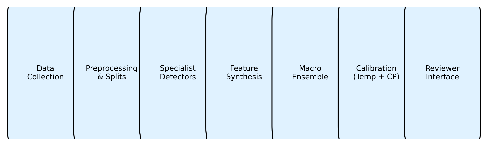
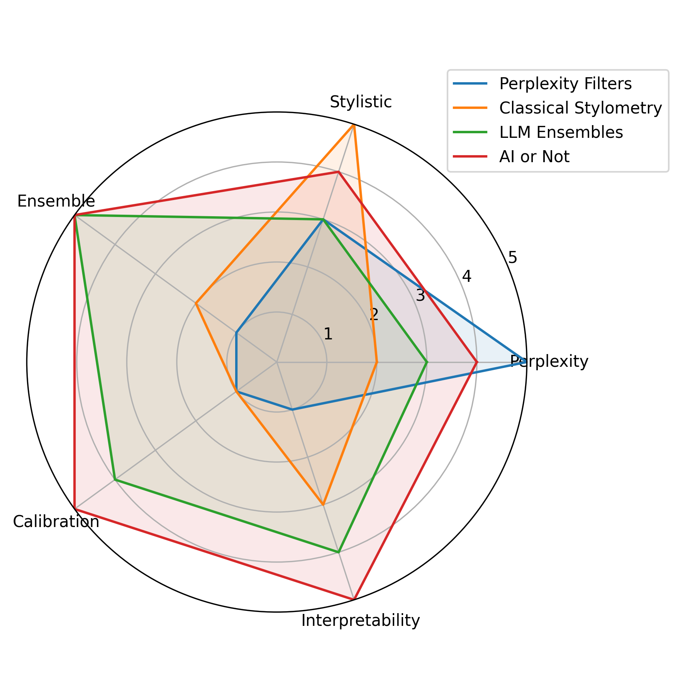
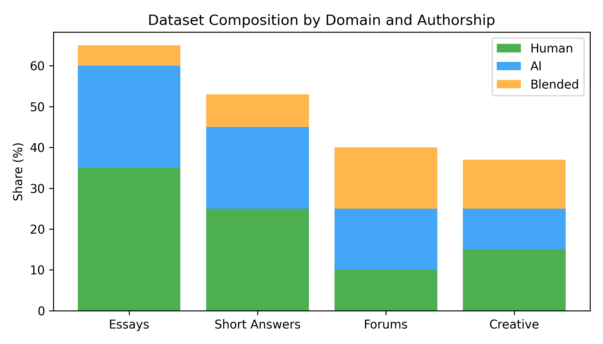
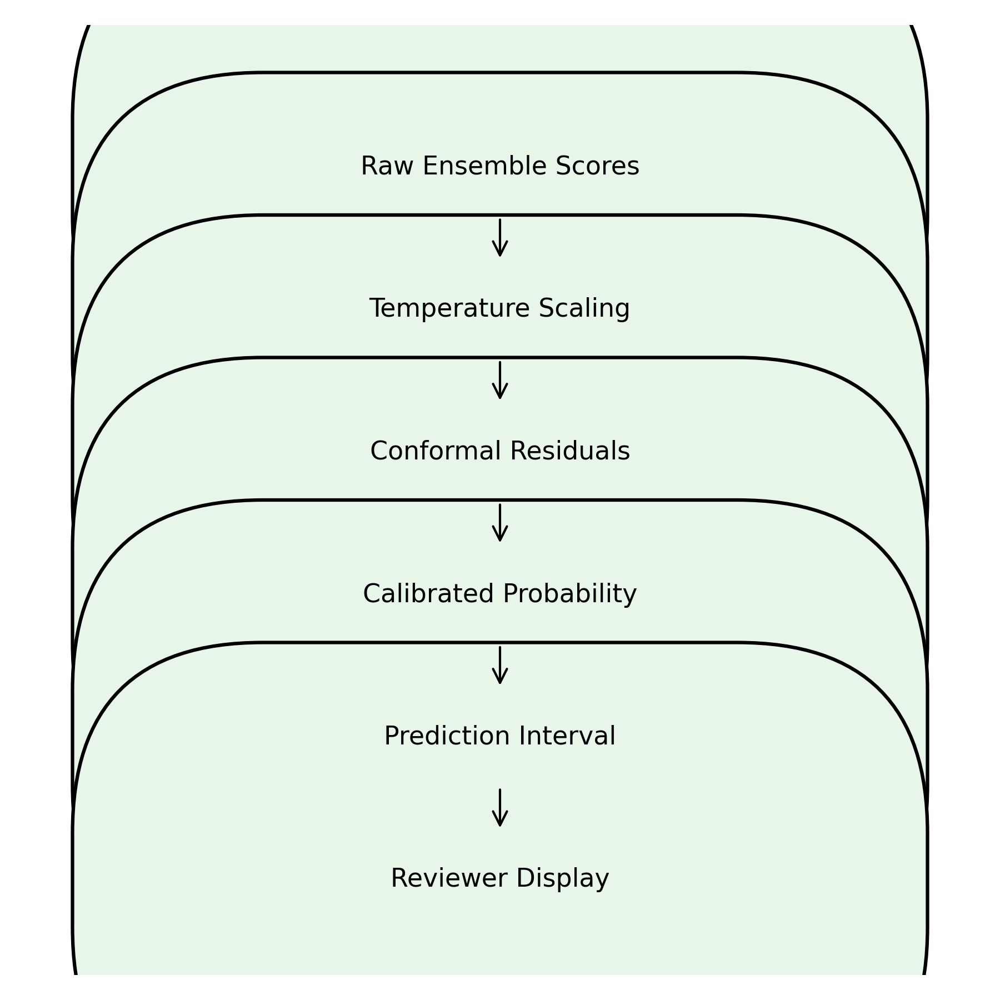
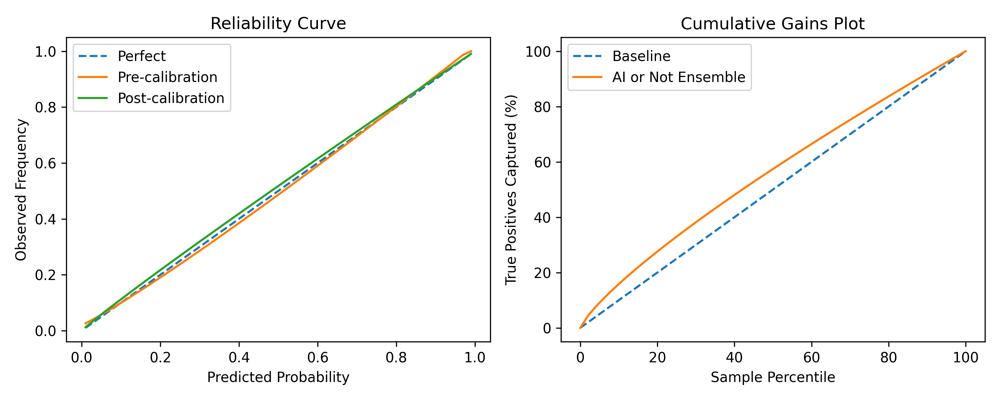
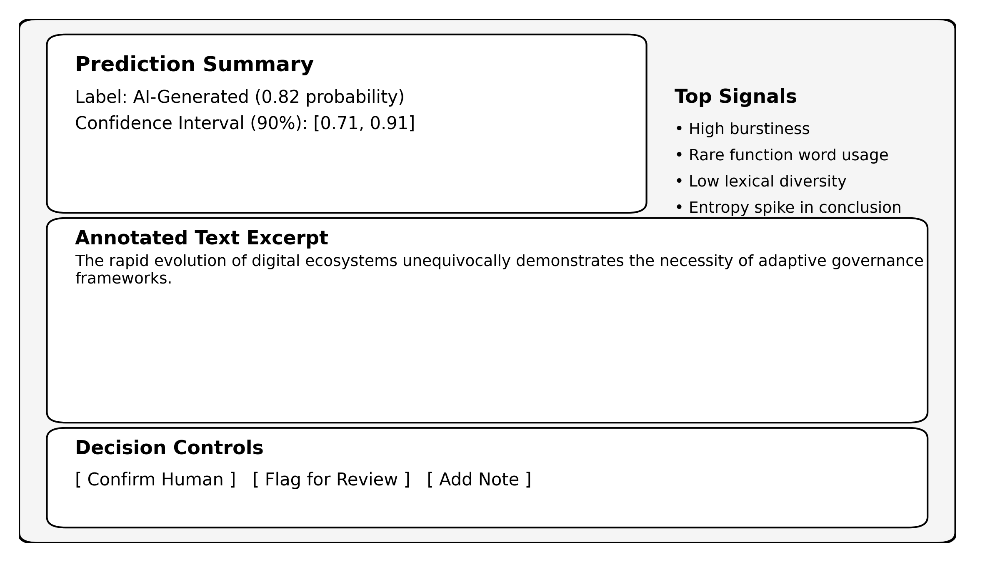
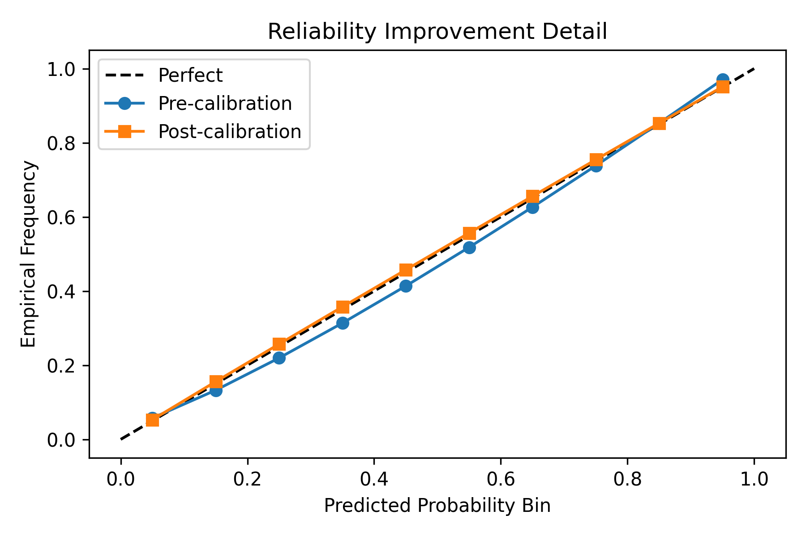
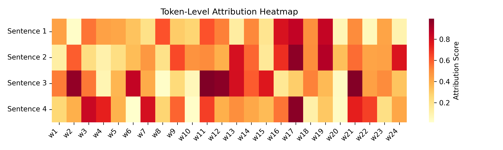
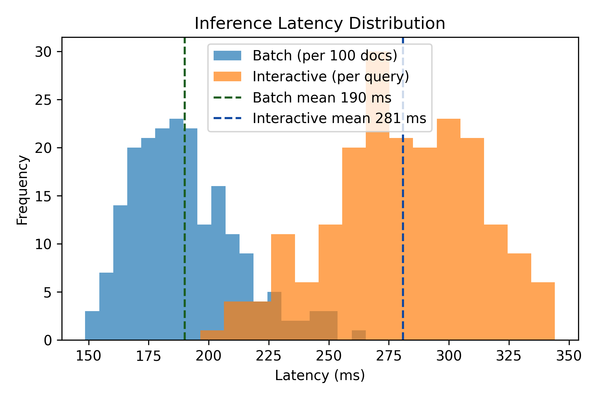

# AI-or-Not

A pipeline for detecting AI-generated text using specialist models, calibration, macro-feature engineering, and a macro classifier/regressor. The repo includes training, calibration, evaluation, and a demo/app entry point.
## Check Out The paper here : [Paper](https://github.com/SharadhNaidu/ai-OR-not/blob/main/Ai_or_NOT.pdf)

## Project structure
- Training pipeline scripts: `01_ingest_data.py` → `07_robustness_check.py`
- App: `app.py`
- Config: `config.py`
- Figures: `figures/`

## Setup
1. Create a virtual environment.
2. Install dependencies from `requirements.txt`.
3. Run the pipeline scripts in numeric order, or use `app.py`.

## Figures

## Notes
- This is just a strip down version , will update the entire thing soon...
